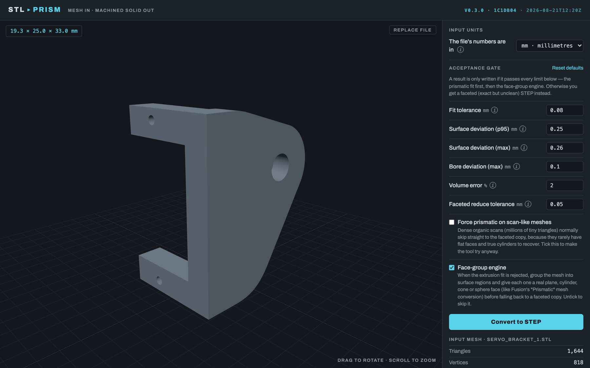
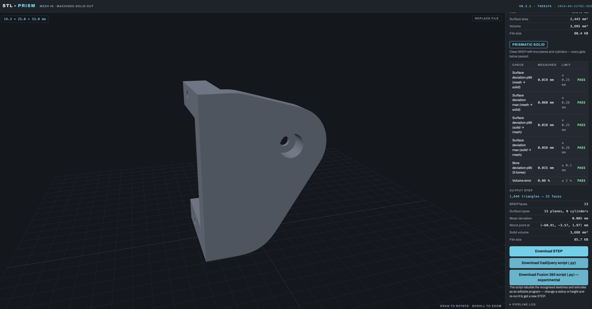
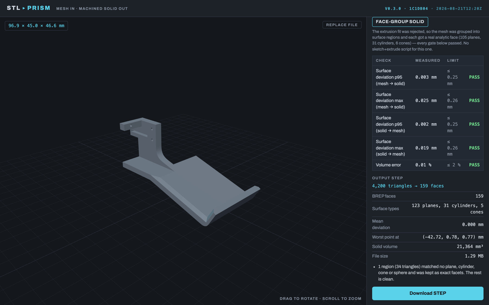
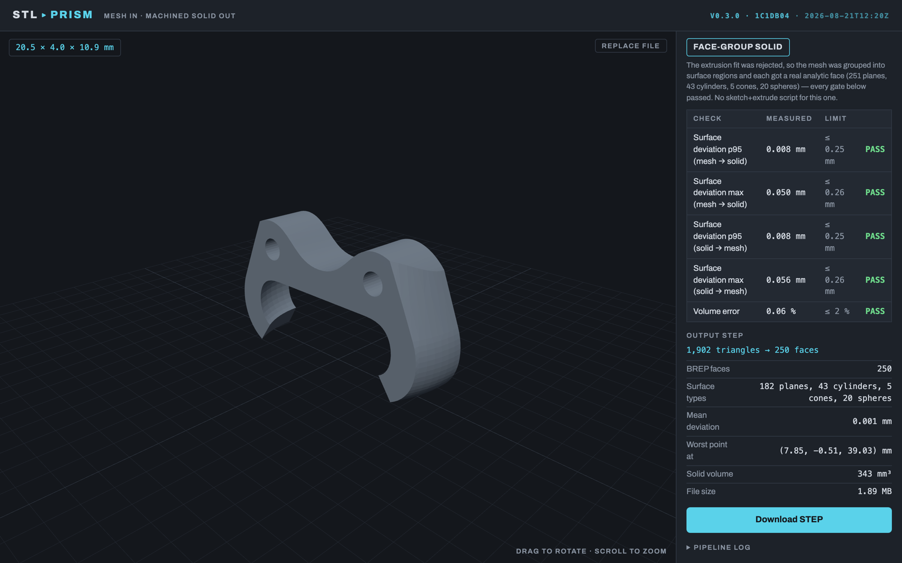
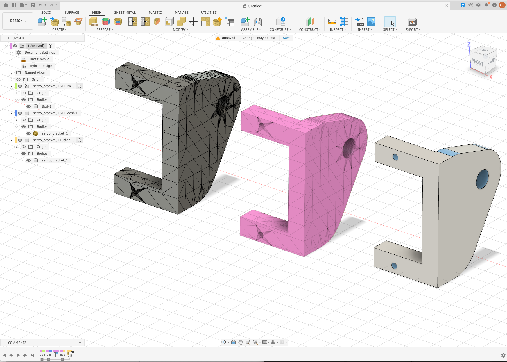
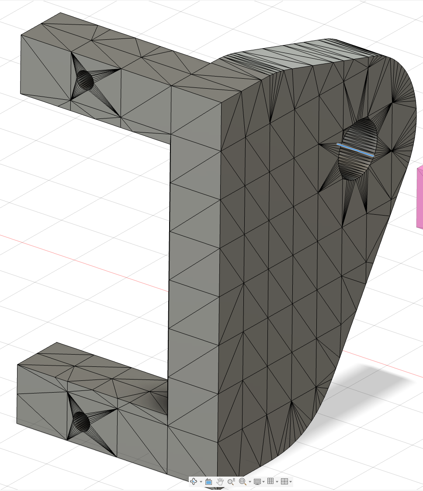
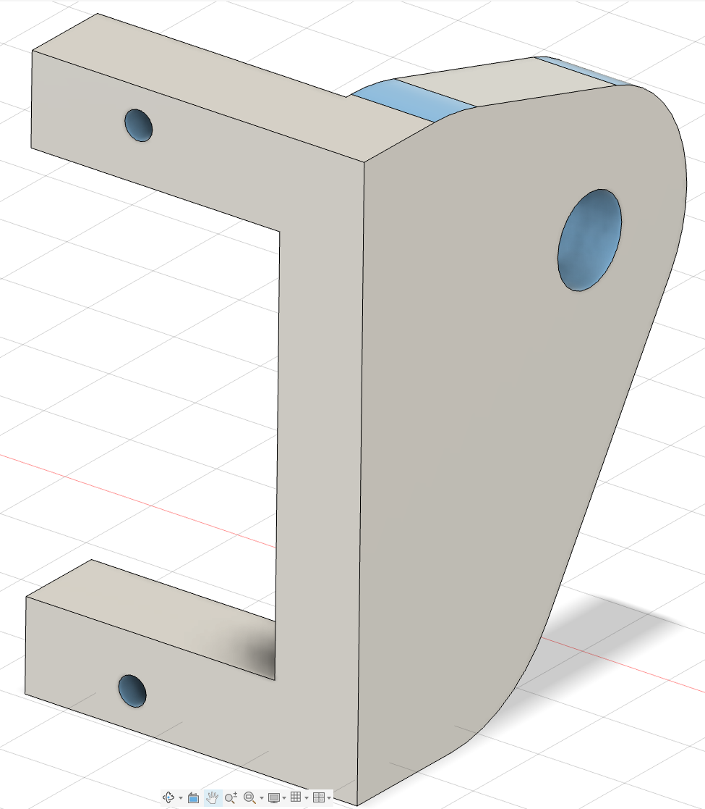

# stl2prism

## Why

I do a lot of hobby 3D-printing projects, designing parts for my own use.
Again and again I needed to model *around* a mesh part — a bracket from
Thingiverse, a scanned housing, a controller shell — and Fusion 360 gave me
no easy way to do it: on the free hobby tier, **Mesh → Solid** turns the
mesh into a solid made of hundreds or thousands of facet triangles, which is
impossible to measure, sketch on, or model against. So I built this: it
turns a mesh into a solid with real planes, cylinders and holes that I can
actually design against once it is imported into Fusion 360 (see the
[comparison](#compared-with-fusion-360s-mesh-to-solid) below).

## What it does

Convert STL / OBJ (also PLY, OFF, 3MF, GLB) meshes into **prismatic STEP
solids** — clean BREP with true planes, cylinders and cones you can sketch
on, dimension against, and constrain — replicating the core of Fusion 360's
paid "Prismatic" mesh conversion, plus something Fusion does not give you: an
**editable CadQuery script** of the sketches and extrudes it recognised.
Guaranteed output: when a mesh isn't an extrusion, the **face-group engine**
groups it into surface regions and gives each a real plane, cylinder, cone or
sphere face (Fusion's face-group approach, in the open); regions nothing fits
keep their exact facets; when even that fails, the tool falls back to a
faceted (valid, manifold, coplanar-merged, tolerance-reduced) STEP solid
instead of failing.

## Screenshots

The web app: drop a mesh, inspect it, set the acceptance gate, convert, and
read the fidelity report before downloading the STEP (and, for extrusions,
the CadQuery / Fusion 360 scripts).

| | |
|---|---|
|  *Mesh loaded; units, acceptance gate, face-group engine toggle.* |  *Servo bracket → prismatic solid: 1,644 triangles → 23 faces (15 planes, 8 cylinders), max deviation 0.060 mm, every gate passed, STEP + scripts offered.* |
|  *Frame (countersinks, multi-direction material) → face-group solid: 4,200 triangles → 159 faces, 31 cylinders + 5 cones, max deviation 0.025 mm.* |  *Joystick claw → face-group solid: 1,902 triangles → 250 faces incl. 43 cylinders and 20 spheres.* |

### Compared with Fusion 360's Mesh to Solid

The same `servo_bracket_1.stl`, opened in Fusion 360 three ways. Left:
Fusion's own *Mesh → Solid* (the free tier's faceted conversion — every
triangle becomes a face). Middle: the STL mesh as loaded. Right: the STEP
from stl2prism — 23 faces, planes and cylinders, holes that are real holes.



| | |
|---|---|
|  *Fusion Mesh → Solid, zoomed in: one face per triangle, so the "solid" carries all 1,644 facets and cannot be sketched on, filleted or measured like a modelled part.* |  *stl2prism output, zoomed in: flat faces are single planes, the blend is one cylinder, the edges are where the design has them.* |

## Install

```bash
pip install .            # core
pip install .[scan]      # + pymeshlab, for 3D-scan repair (Poisson; Linux x86_64)
```

## Usage

```bash
stl2prism part.stl                 # -> part.step  (+ part.py CadQuery script)
stl2prism part.obj --units cm      # file is in cm (Fusion's OBJ default); scale to mm
stl2prism part.stl out.step --tol 0.05 --accept-max 0.3 --accept-vol-pct 3
stl2prism scan.stl --reduce-tol 0.1     # faceted output: simplify curved regions within 0.1 mm
stl2prism scan.stl --force-prismatic    # attempt prismatic on scan input
stl2prism part.stl --no-face-groups     # skip the face-group engine (prismatic -> faceted only)
```

Or from Python:

```python
from stl2prism import run
result = run("part.stl", "part.step")
print(result["mode"], result["metrics"], result["script"])   # 'prismatic' | 'facegroup' | 'faceted' | 'mixed'
```

Exit code 0 on success. The log reports which route produced the output
(`prismatic`, `facegroup` or `faceted`) and the measured fidelity (surface
deviation both ways, bore deviation, volume error) of prismatic and
face-group results.

## Web app

A browser UI for the same pipeline: drag a mesh in, inspect it in 3D, set
the acceptance tolerances, convert, and download the STEP (and, for
prismatic results, the CadQuery and Fusion 360 scripts) with a fidelity
report (route, surface deviation vs. your limits, volume error, face counts
and surface types, regions kept as facets).

### Run locally (dev)

```bash
python -m venv .venv && .venv/bin/pip install -e . fastapi 'uvicorn[standard]' python-multipart
.venv/bin/uvicorn backend.main:app --port 8000     # API
cd frontend && npm install && npm run dev           # UI on :5173, proxies /api
```

### Run as a container

```bash
docker compose up --build        # then open http://localhost:8321
./deploy.sh                      # same, but stamps the image with the git commit,
                                 # shown top-right in the UI and at /api/version
```

To run it on a home NAS (any x86_64 box with Docker — TerraMaster, Synology,
QNAP; clone on the NAS, build natively, optional Tailscale HTTPS front), follow
[docs/DEPLOY-NAS.md](docs/DEPLOY-NAS.md).

Environment knobs: `STL2PRISM_DATA` (job storage dir, default `/data` in
the container), `STL2PRISM_JOB_TTL` (seconds before old jobs are purged,
default 86400), `STL2PRISM_MAX_UPLOAD` (bytes, default 200 MB).

## How it works

The pipeline implements the classical reverse-engineering architecture
(segmentation -> primitive fitting -> constraint solving -> rebuild), using
the *extrusion-cylinder* decomposition strategy rather than free surface
stitching — which sidesteps the brittle face-intersection/topology problem
that makes general mesh-to-BREP hard — extended with lofts, cross-axis
features and local patching so that one axis need not explain everything.

1. **Prep** (`mesh_prep`) — load, weld, repair. Vertices closer than 1e-6 of
   the bounding box are welded (exporters leave micron cracks that split a
   part), duplicate/degenerate faces dropped, OBJ per-corner normals/UVs
   merged away. Units (`--units mm|cm|in|ft|m`) scale the mesh on load; the UI
   suggests a unit from the bounding box. Connected shells are split into
   bodies; a shell *inside* another is an internal cavity and is attached to
   its body as a void, so a hollow part becomes one hollow solid. Scan-like
   input (dense, low dihedral, no exactly-coplanar facets) is rebuilt via the
   pymeshlab repair ladder and decimated with topology preservation.
2. **Axis discovery** (`extrusion`) — face normals are clustered on the
   Gaussian sphere; each candidate axis is offered raw *and* snapped to
   global XYZ (when within 5°) and *scored* by the volume fraction of the
   part that has a constant (or linearly varying) cross-section along it,
   with the perpendicular-face area as a tie-breaker. Snapping is a
   hypothesis, not a decision: a part tilted 3° keeps its true axis.
3. **Slab decomposition** — planar faces perpendicular to the axis vote for
   height levels; each slab is cross-sectioned at several heights *and* just
   inside its ends. Where the section starts or stops changing (a chamfer,
   countersink or boss top) or its topology changes, a level is inserted by
   bisection and snapped to a mesh-vertex height. Constancy compares section
   *shapes* (IoU + boundary distance), not just areas.
4. **Profile fitting** (`profile_fit`) — each polygon ring is segmented into
   **lines and circular arcs**: recursive split (at real corners first),
   Taubin circle fits with deviation measured against the whole polyline
   (chord interiors included, so a big circle through the ends of a straight
   wall cannot pass), a cyclic merge pass, boundary refinement between
   neighbours, arc radii/centres re-fitted on the mesh vertices (which lie
   exactly on the CAD surface — section vertices sit on chords), and
   junction solving: line/line at their intersection, tangent line/arc
   fillets solved exactly, lines squared to the dominant frame.
5. **Constraint snapping** (GlobFit-lite, `rebuild._global_snap`) — radii and
   centres are clustered *globally across all slabs* and snapped to cluster
   means. This turns facet-noise families like r = 5.242..5.257 into a
   single design radius.
6. **Rebuild** (`rebuild`) — constant slabs are extruded; slabs whose section
   varies linearly (drafts, chamfers, countersinks, tapered ribs) are
   **lofted with analytic faces** — planes between matched lines, cones /
   cylinders between matched arcs and circles. Equal consecutive slabs are
   merged, Booleans use a fuzzy tolerance, and a finishing pass drops
   micro-edges, unifies same-domain faces and checks validity.
7. **Cross-axis features** (`features`) — curved facet regions are split
   into coaxial primitives and classified: **cylinders** (bores not parallel
   to the main axis, radius/axis refined by least squares on the vertices,
   blind ends kept blind) and **cones** (countersinks, chamfered hole
   mouths) are subtracted as analytic features.
8. **Validate + gate** (`pipeline`) — deterministic, *symmetric* deviation
   (mesh → solid on area-uniform samples plus every vertex; solid → mesh),
   bore deviation, volume error. Passing → prismatic. Failing → the next
   rungs, each held to the same gate:
   * **Face-group engine** (`facegroups`) — the mesh's coplanar components
     are seeds for a greedy, fit-driven region growing (never across a
     dihedral > 25°): a region grows while a plane / cylinder / cone / sphere
     (simplest first) explains its **vertices** within a few microns and its
     facet interiors within the fit tolerance — the second test is what stops
     a wide plane and its first fillet strip from being fitted by an exact,
     absurdly large cylinder. Directions, coaxial axes, coplanar offsets and
     equal radii are then snapped within measurement uncertainty (reverted
     if a snap moves a surface off its vertices), and every region becomes
     one trimmed face on its fitted surface: boundary polylines projected
     onto the surface (a shared vertex table keeps both sides of every edge
     identical for sewing), `MakeFace` + `ShapeFix_Face`, seams placed
     through boundary vertices. Regions no primitive fits, or whose face
     will not build, keep their exact facets. Sew → largest solid → heal →
     check → gate. Mode `facegroup`; no sketch/extrude script for it.
   * **Hybrid patch** (`hybrid`): the prismatic solid with its deviating
     regions boxed and replaced by the exact faceted geometry,
     `(P − B) ∪ (F ∩ B)`, re-checked. Keeps the script.
   * **Faceted** route: coplanar triangles merged into single planar faces
     *before* sewing, curved regions decimated within `--reduce-tol`, sewn
     into a manifold solid.
9. **Export** — one STEP (AP214) with **named bodies and faces coloured by
   surface type**, plus a **CadQuery script** (`<out>.py`) that rebuilds the
   recognised sketches, extrudes, lofts and feature cuts with named
   parameters (radii `R_n`, heights `H_n`) — edit a value, re-run, get a new
   STEP.

### Research basis

The architecture follows the standard two-phase scan-to-BREP paradigm
(segmentation + fitting) established by Schnabel et al.'s Efficient RANSAC
(2007) and surveyed in recent literature; the extrusion-cylinder
decomposition is the classical analogue of Point2Cyl (CVPR 2022) / PrismCAD;
global constraint snapping follows GlobFit (Li et al.); validation-gated
output with honest fallback and local patching is our own addition.

## Measured results (v0.3)

Default gates (fit tol 0.08 mm, p95 ≤ 0.25, max ≤ 0.26, bore ≤ 0.10 mm,
volume ≤ 2 %). "faces" = ADVANCED_FACE count in the STEP.

| part | triangles | mode | faces | max dev | vol err |
|---|---|---|---|---|---|
| servo_bracket_1 | 1,644 | prismatic | 23 (was 60) | 0.060 mm | 0.08 % |
| servo_bracket_2 | 1,712 | prismatic | 19 (was 28) | 0.044 mm | 0.06 % |
| top_arm_1 | 3,896 | prismatic (chamfered bosses as cones) | 44 (was 1,245 faceted) | 0.050 mm | 0.00 % |
| top_arm_2 | 3,816 | prismatic | 40 (was 1,213 faceted) | 0.050 mm | 0.05 % |
| joystick_claw_1 | 2,134 | face-group (63 cyl, 13 spheres, 6 cones) | 553 (was 671 patched) | 0.051 mm | 0.09 % |
| joystick_claw_2 | 1,902 | face-group (43 cyl, 20 spheres, 5 cones) | 250 (was 341 faceted) | 0.050 mm | 0.10 % |
| frame | 4,200 | face-group (31 cyl, 5 cones) | 160 (was 516 faceted) | 0.022 mm | 0.01 % |
| Mesh_90p (scan) | 2.17 M | faceted (scan route) | 39,575 | — | 0.00 % |

The remaining planar faces on the face-group parts are blends (tori,
free-form) that v1 keeps as exact facets.

v0.3.1 (profile-fit fidelity): the prismatic profile fitter no longer lets
one circle absorb an exactly straight wall next to a gentle arc (a flat
mesh face used to come out as an r = 50–200 mm cylinder, a different one
per slab), walls and arcs are unified across slabs (no more micron-wide
seam faces on flat faces), and a perpendicular face under 0.25 mm from its
neighbour is a level of its own when it is not edge-connected to it (a
0.15 mm ledge used to be merged away). servo_bracket_1 went 60 → 23 faces
with the same deviation.

Synthetic CAD parts (see `tests/test_matrix.py`, `tests/test_facegroups.py`):
plates with holes/fillets, obround slots, hex pockets, stepped shafts, cross
and blind holes, hollow parts, drafted blocks, chamfers, countersinks, small
interior steps, tilted and rotated parts, tiny (3 mm) and huge (1.5 m) parts
convert to the exact face count with sub-0.1 mm deviation on the prismatic
route; a sphere boss (6 planes + 1 sphere), a top-edge-filleted box (6
planes + 4 cylinders), a plate with a spherical dimple and an icosphere (one
spherical face) come out exact through the face-group engine.

## Limitations (v0.3)

* The **CadQuery / Fusion script** only exists for prismatic results (the
  extrusion engine is the only route that yields sketch + extrude structure);
  face-group results are clean B-rep without a script.
* The face-group engine fits **planes, cylinders, cones and spheres**; tori
  (rolling-ball fillets around corners) and free-form blends keep their
  exact facets. It targets CAD exports (coplanar facet pairs); scans stay on
  the faceted route. Face edges are the projected mesh polylines (chords),
  not surface–surface intersection curves yet.
* Scan input defaults to faceted (`--force-prismatic` overrides); the scan
  repair ladder needs pymeshlab (Linux x86_64).
* The CadQuery script reproduces the recognised extrusion structure; patched
  regions are not in the script.

## Roadmap

In rough priority order:

- **Clean intersection edges on face-group solids.** Today each analytic face
  is bounded by the mesh's own polyline edges. First via a Fusion 360 script
  that recreates the fitted surfaces oversized and lets Fusion's Boundary
  Fill compute the true edges; later natively in the STEP.
- **Torus fitting for corner blends** — the rolling-ball corners where two
  fillets meet are still kept as facets, which is most of the face count on
  filleted parts.
- **Named features in the generated script** — `hole()`, counterbores and
  `fillet()` calls instead of raw cylinder cuts.
- **Region growing for 3D scans** — real faces on scanned parts instead of a
  faceted solid.
- **Faster conversions** — warm worker process, bodies converted in parallel.

## License

**PolyForm Noncommercial 1.0.0** — see [LICENSE](LICENSE). In short: you may
use, copy, change and share this software for personal, hobby, educational,
research and other noncommercial purposes. Any commercial use needs the
author's permission — get in touch.

Third-party components keep their own licences (CadQuery Apache-2.0,
OpenCascade LGPL-2.1 with exception, trimesh MIT, shapely/networkx BSD).
The optional `scan` extra pulls in **pymeshlab, which is GPL-3.0**; it is not
part of this package's licence and is installed only if you ask for it.
